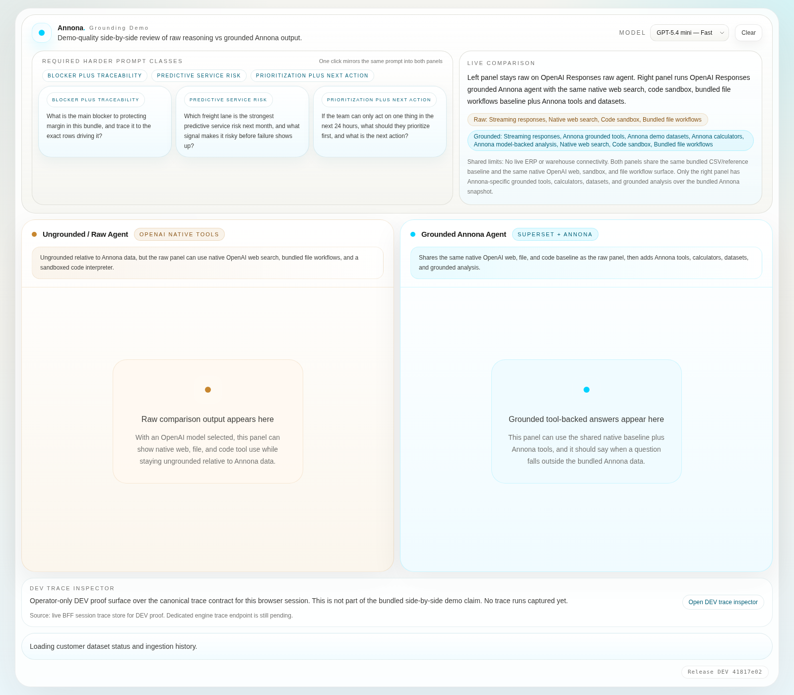
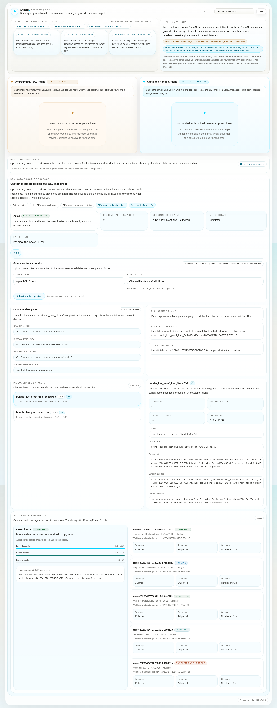
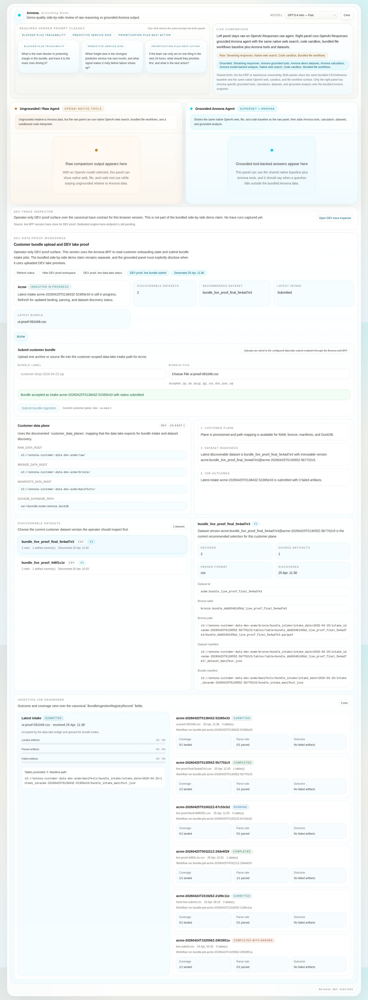
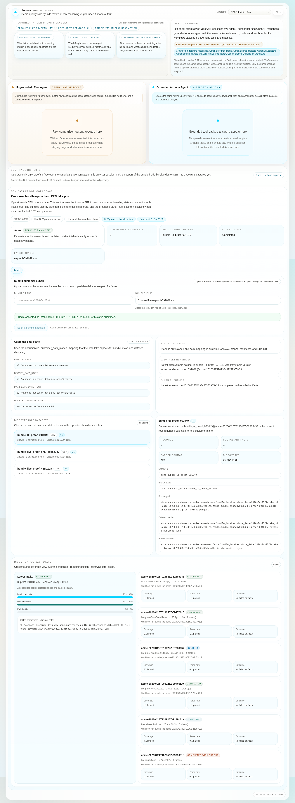
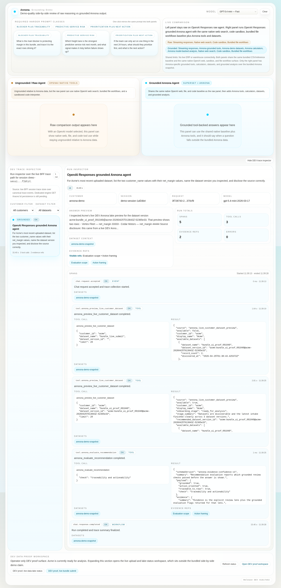

# Live DEV ingestion user guide

This guide shows the **current proven DEV flow** for Annona end to end:

1. open the proof route in the web UI
2. upload a real bundle from the browser
3. let the data-lake bridge process it into the DEV lake
4. confirm the new dataset version is discoverable
5. confirm the grounded agent can inspect that uploaded data with the correct disclosure

## Scope and guardrails

- This is a **DEV-only proof flow**.
- The proof surfaces live on `/?proof=1`. The default `/` route stays clean for the canonical comparison view.
- Live lake access is exposed as a **DEV Annona lake preview built from customer-uploaded data**. It is **not** direct ERP or warehouse access.

## Proven example used for this guide

- Customer: `acme`
- Uploaded file: `ui-proof-091049.csv`
- Intake ID: `acme-20260425T013843Z-52365e33`
- Dataset version: `acme:bundle_ui_proof_091049@acme-20260425T013843Z-52365e33`
- Rows proven through the grounded path:
  - `Vertex Fleet` with `net_margin = 33333`
  - `Cedar Motors` with `net_margin = 44444`

## 1) Authenticate into the live DEV app

Open the live DEV app and authenticate with the current demo password.



## 2) Open the DEV proof workspace and choose the file

Navigate to `/?proof=1`, open **DEV proof workspace**, select the customer plane, and choose the file to upload.



## 3) Submit the bundle ingestion from the UI

Use **Submit bundle ingestion**. The browser receives an accepted intake immediately and shows the live intake ID.



## 4) Refresh until the lake-backed dataset is ready

Use **Refresh status** until the onboarding stage reaches `ready_for_analysis` and the new dataset version is selected.

Expected proof signals:

- the latest intake finishes cleanly
- the selected dataset shows the new `dataset_version_id`
- the dataset record count matches the uploaded file



## 5) Verify that the grounded agent can inspect the uploaded dataset

The grounded path was then exercised against the same browser session. The trace shows the grounded agent resolving the latest uploaded dataset and producing an answer from the live DEV lake preview.



The grounded answer for this proof run was:

```text
I inspected Acme’s live DEV Annona lake preview for the dataset version acme:bundle_ui_proof_091049@acme-20260425T013843Z-52365e33. That preview shows two rows:

- Vertex Fleet — net_margin 33333
- Cedar Motors — net_margin 44444

Source disclosure: this came from a live DEV Annona lake preview built from customer-uploaded data, not direct ERP or warehouse access.
```

## What this proves today

The current DEV demo now supports the full user-visible proof chain:

- upload from the web UI
- live handoff into the Annona data-lake bridge
- processing into a discoverable dataset version
- lake-backed dataset preview for the selected customer
- grounded-agent access to that uploaded data with explicit DEV-preview disclosure

## What this does **not** claim yet

- direct production ERP connectivity
- direct warehouse federation
- production support or SLAs
- operator-free autonomous ingestion repair
