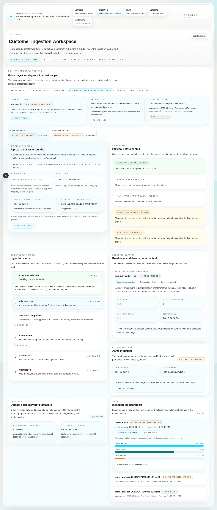
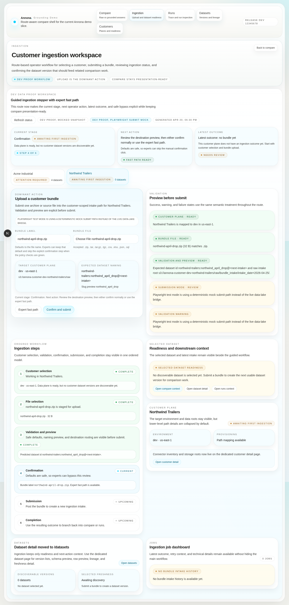
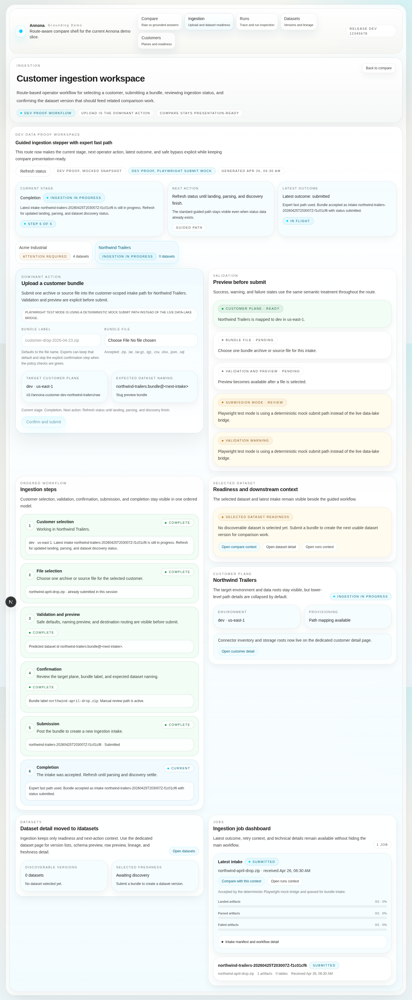
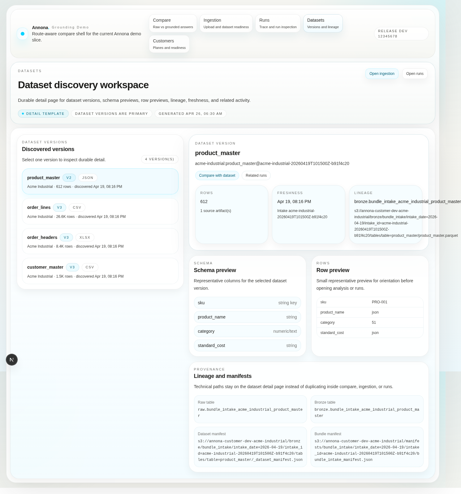
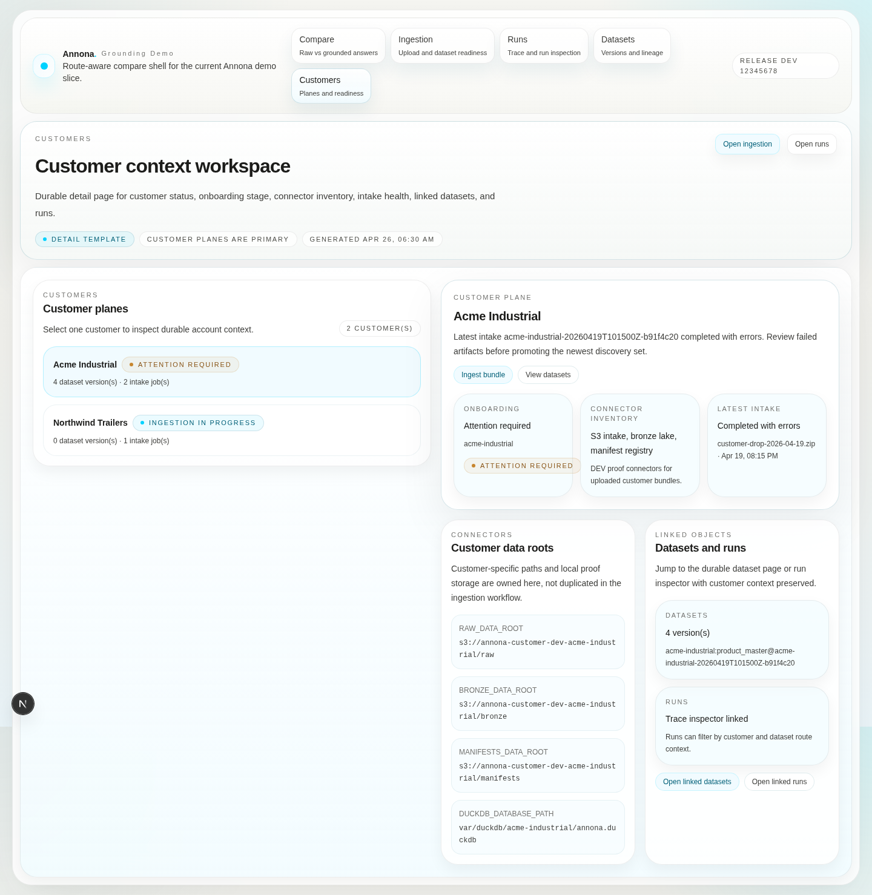

# Live DEV ingestion user guide

This is the canonical operator guide for live customer bundle ingestion in the Annona DEV web UI.

The current user path is:

1. authenticate into the DEV app
2. open `/ingestion`
3. choose the customer plane
4. select one accepted bundle or source file
5. review validation, destination preview, and dataset naming
6. submit through the guided workflow or expert fast path
7. refresh status until the job reaches a terminal state
8. inspect `/datasets`, `/customers`, `/runs`, and `/compare` for landed data and grounded proof

## Scope and guardrails

- This is a **DEV-only proof flow**.
- `/ingestion` is the canonical onboarding and upload route for operators.
- `/datasets` owns durable dataset versions, schema preview, row preview, lineage, freshness, and related activity.
- `/customers` owns customer onboarding stage, connector inventory, latest intake health, linked datasets, and linked runs.
- Live lake access is disclosed as a **live DEV Annona lake preview built from customer-uploaded data**. It is **not** direct ERP or warehouse access.
- Live submit requires the deployed web runtime to have `ANNONA_DATA_LAKE_SUBMIT_URL` and `ANNONA_DATA_LAKE_STATUS_URL` wired to the DEV data-lake bridge.
- Screenshots labeled `Mocked DEV snapshot` or `Playwright submit mock` validate route UX only; they do not prove bridge persistence.

## Validated route structure

| Route | What to look for |
| --- | --- |
| `/ingestion` | Customer ingestion workspace, current stage, next action, latest outcome, guided steps, upload CTA, validation preview, expert fast path, selected dataset readiness, and links to compare/datasets/runs. |
| `/datasets` | Dataset discovery workspace with version list, schema preview, row preview, lineage, freshness, and related activity. |
| `/customers` | Customer context workspace with onboarding stage, connector inventory, latest intake health, linked datasets, and linked runs. |
| `/runs` | Run inspection workspace for traces, tool calls, evidence refs, timings, and failures. |
| `/` or `/compare` | Presentation-ready side-by-side comparison without embedded upload forms. |

## Live proof artifact lineage

The successful live submit screenshots currently available were captured before the route split, when the upload proof workspace lived behind `/?proof=1`. They are still valid proof that the deployed DEV browser submit path reached the data-lake bridge, produced a durable intake, surfaced a dataset version, and powered a grounded answer from uploaded data.

Use them as **live proof artifacts**, not as current `/ingestion` route screenshots. The current `/ingestion`, `/datasets`, and `/customers` screenshots in this repo are Playwright/mock UX captures and are labeled separately.

Proven live example:

| Field | Value |
| --- | --- |
| Customer | `acme` |
| Uploaded file | `ui-proof-091049.csv` |
| Intake ID | `acme-20260425T013843Z-52365e33` |
| Dataset version | `acme:bundle_ui_proof_091049@acme-20260425T013843Z-52365e33` |
| Proven rows | `Vertex Fleet` with `net_margin = 33333`; `Cedar Motors` with `net_margin = 44444` |

## 1) Authenticate into the DEV app

Open the DEV app and authenticate with the current demo password. After authentication, use the app shell navigation to open `/ingestion` for operator upload work.

Live proof artifact from the earlier proof workspace:

## 2) Open the guided ingestion workflow

Navigate to `/ingestion`. The page should show **Customer ingestion workspace**, a current-stage card, a next-action card, a latest-outcome card, and the ordered ingestion steps.

The ordered workflow is:

1. Customer selection
2. File selection
3. Validation and preview
4. Confirmation
5. Submission
6. Completion

## 3) Select the customer and file

Choose the target customer plane, then select one accepted archive or source file. The current live bridge advertises these accepted extensions through the customer-status contract:

- `.zip`
- `.tar`
- `.tar.gz`
- `.tgz`
- `.csv`
- `.xlsx`
- `.json`
- `.sql`

The UI previews the target plane, expected dataset naming, raw intake root, validation state, and submission mode. When safe defaults are satisfied, **Expert fast path** becomes available for repeat operators who do not need the extra confirmation click.

Live proof artifact showing the earlier proof workspace with a real CSV selected:

## 4) Submit the bundle

Use either **Confirm and submit** in the guided workflow or **Expert fast path** when the page marks it safe. In the live DEV path, the web BFF posts a `multipart/form-data` request to the data-lake bridge with:

- `customer_id`
- `bundle_name`
- the selected `bundle` file

A successful accepted response returns the intake/job metadata immediately, including `customer_id`, `intake_id`, `bundle_name`, `received_at`, RAW/BRONZE/manifest roots, `manifest_path`, `workflow_run_id`, and initial `status = submitted`.

Live proof artifact showing a real accepted submit in the earlier proof workspace:

## 5) Refresh until the job is terminal

After submit, use **Refresh status** until landing, parsing, discovery, and readiness finish. A clean run should eventually show the customer moving to analysis-ready state and select the newly discovered dataset version.

Expected proof signals:

- latest intake reaches a terminal state
- selected dataset shows the expected `dataset_version_id`
- dataset record counts and previews match the uploaded file or bundle
- RAW, BRONZE, and manifest roots point at the DEV customer data plane
- `/runs` can show enough trace/request context for operator review when the dataset is used downstream

Live proof artifact showing the dataset ready after the accepted submit:

## Job states

The app-triggered ingestion contract records an append-only job history in DuckDB and exposes the latest state through customer-status polling.

| State | Meaning | Operator action |
| --- | --- | --- |
| `submitted` | The bridge accepted the browser upload, created the intake/job identity, and queued or started bundle intake. | Keep the page open or refresh status; do not assume data is queryable yet. |
| `running` | The data-lake runtime is landing, unpacking, parsing, promoting, and registering outputs. | Continue polling; inspect only if it remains stuck longer than expected. |
| `completed` | All accepted artifacts landed and parseable outputs were promoted/discovered. | Open `/datasets` and `/customers`, then verify grounded use through `/compare` and `/runs`. |
| `completed_with_errors` | The intake finished with at least one failed, quarantined, or unparseable artifact, but may still have usable promoted datasets. | Review latest outcome, manifest counts, quarantine reasons, and row counts before using the dataset. |
| `failed` | The bridge or intake run failed before a usable terminal output was produced. | Capture the intake/job ID, error detail, and time; retry only after the failure cause is understood. |

## Where landed data ends up

The live DEV bridge uses the Annona customer data plane for `acme` and reports these roots through `/api/customer-status`:

| Layer | Current DEV location | What lands there |
| --- | --- | --- |
| RAW | `s3://annona-customer-data-dev-acme/raw/` | Original accepted artifacts under `bundle_intake/intake_date=YYYY-MM-DD/intake_id=<intake_id>/artifacts/sha256=<fingerprint>/...`; quarantined artifacts under the same intake path with `quarantine/reason=<reason>/...`. |
| BRONZE | `s3://annona-customer-data-dev-acme/bronze/` | Generic promoted bundle-scoped Parquet tables under `bundle_intake/intake_date=YYYY-MM-DD/intake_id=<intake_id>/tables/table=<slug>/<slug>.parquet`, plus `_dataset_manifest.json` and `_dataset_profile.json`. |
| Manifests | `s3://annona-customer-data-dev-acme/manifests/` | The top-level `bundle_intake_manifest.json` with artifact counts, parsed/quarantined counts, registry entries, dataset versions, file membership, and lineage. |
| DuckDB | `var/duckdb/acme/annona.duckdb` in the DEV data-lake runtime | Job history and latest job status in `meta.app_bundle_ingestion_job_history` / `meta.app_bundle_ingestion_jobs`; dataset discovery from `meta.customer_dataset_registry` or `meta.customer_dataset_discovery`; dataset versions and file membership from `meta.customer_dataset_versions` and `meta.customer_dataset_file_membership`. |

The current bundle slice promotes parseable files into generic bundle-scoped tables. It does **not** yet automatically route those tables into source-specific NetSuite, Focus, or S3 bronze contracts.

## 6) Inspect durable dataset detail

Open `/datasets` from the app shell or an ingestion deep link. Confirm version list, schema preview, row preview, lineage, freshness, and related activity for the new dataset version.

## 7) Inspect customer context

Open `/customers` to review customer-plane detail, onboarding stage, connector inventory, latest intake health, linked datasets, and linked runs.

## 8) Verify grounded use of uploaded data

After a live DEV upload has produced a discoverable dataset version, use `/compare` and `/runs` to verify the grounded path. Grounded answers must disclose that their source is a live DEV Annona lake preview built from customer-uploaded data.

Live proof artifact showing the uploaded dataset used through the grounded path:

The grounded answer for the live proof run said it inspected dataset version `acme:bundle_ui_proof_091049@acme-20260425T013843Z-52365e33`, found the two uploaded rows, and disclosed that the data came from a live DEV Annona lake preview rather than direct ERP or warehouse access.

## Current limits and failure modes

- This guide covers the DEV proof path only; it is not a production SLA or support commitment.
- If `ANNONA_DATA_LAKE_SUBMIT_URL` or `ANNONA_DATA_LAKE_STATUS_URL` is missing, the UI falls back to deterministic DEV snapshots and live submission is disabled outside Playwright test mode.
- `completed_with_errors` can still produce partial datasets; operators must inspect manifest counts, quarantine reasons, and row counts before treating the dataset as ready.
- SQL dump support is intentionally narrow: only bounded SQLite-style `CREATE TABLE` / `INSERT INTO` dumps are restored in this slice.
- Nested archives are supported only to a bounded recursion depth.
- The bridge stages uploads in runtime-local temp storage until ingestion finishes; lifecycle cleanup for staged temp files is not a production-grade guarantee in this slice.
- Production auth hardening, queue orchestration, and platformized retry/repair remain outside this DEV proof contract.
- This does not claim direct production ERP connectivity, direct warehouse federation, or operator-free autonomous ingestion repair.
