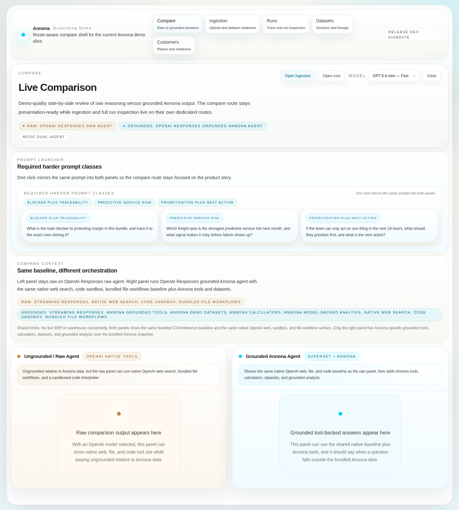
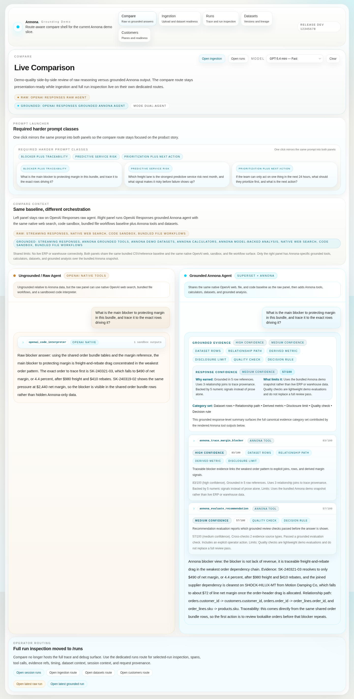
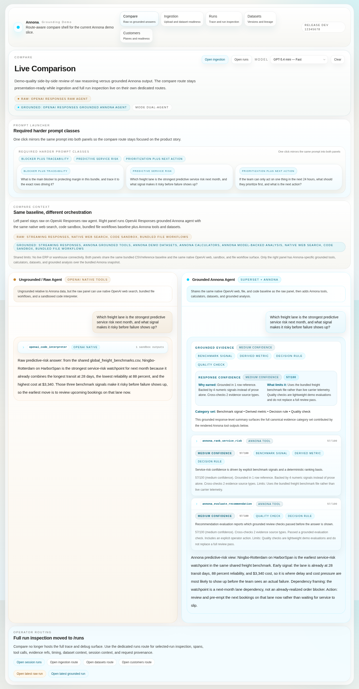
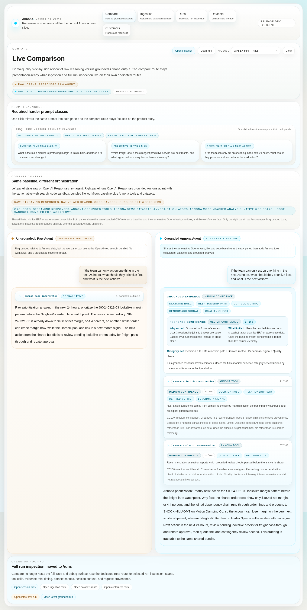
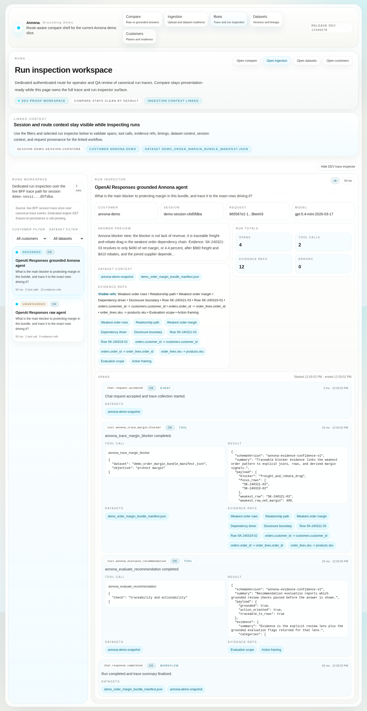

# DEV comparison demo and trace surfaces

!!! warning "DEV only"
    This page documents the Annona DEV comparison demo as validated today. It is not a production guide, a customer SLA, a production authentication model, or a promise of live ERP or warehouse connectivity.

## Current public DEV URL

The current public DEV service URL validated by the latest successful DEV deploy proof is:

`http://a310d316a546e4c76800354b77ed5c2f-1981527800.us-east-1.elb.amazonaws.com`

Validation source: `goAnnona/annona-customer-infra` run `24930794611`, completed successfully on `2026-04-25T12:23:59Z`, with `smoke-dev` and `proof-dev` artifacts captured against that base URL.

## Authentication boundary

- The service is publicly reachable at the DEV load-balancer URL above.
- The app is protected by the DEV demo password gate when the `DEMO_PASSWORD` runtime secret is configured.
- The latest smoke artifact records `POST /api/auth/check` as passed for the configured DEV demo password.
- The docs intentionally do not publish the demo password. Operators should retrieve it from the approved secret path for the DEV environment.
- This is a DEV password boundary, not production SSO, tenant isolation, production authorization, or a customer-facing access-control claim.

## What the comparison route proves

`/` and `/compare` are the canonical side-by-side comparison routes for the current demo slice. The current live proof captures the authenticated comparison shell with the route-aware app navigation, model selector, prompt launcher, raw panel, grounded panel, and links to `/ingestion` and `/runs`.

The comparison route is intentionally presentation-focused. Upload and onboarding work belongs on `/ingestion`; durable dataset review belongs on `/datasets`; customer-plane review belongs on `/customers`; trace/run inspection belongs on `/runs`. See the [Annona user guide](../user-guide.md) for the route map.

## Panel boundaries

| Surface | Allowed today | Must not claim |
| --- | --- | --- |
| Raw panel | Uses the selected OpenAI model as a raw/ungrounded comparison agent. It may use the shared native baseline shown in the UI: streaming responses, native web search where configured, sandboxed code workflows, and bundled file workflows. It may reason over the same bundled reference files that are deliberately available to both panels. | It must not use Annona-only tools, Annona calculators, Annona trace contracts, Annona-specific dataset lookup, customer status, or grounded Annona evidence. It is ungrounded relative to Annona data. |
| Grounded Annona panel | Uses the same native baseline as the raw panel, then adds Annona grounded tools, Annona demo datasets, calculators, evidence/confidence metadata, and grounded model-backed analysis. It should disclose when an answer is based on bundled demo data or the live DEV lake preview. | It must not imply direct live ERP access, direct warehouse federation, unrestricted customer data access, production ingestion guarantees, or that every possible prompt can be grounded. |
| Shared baseline | Both panels can be compared against the same prompt and the same bundled CSV/reference baseline for the proven prompt scenarios below. | Shared bundled data is not a production customer system, not a complete business record, and not proof of arbitrary uploaded-data coverage. |

## Proven prompt scenarios

The following scenarios are currently proven by the PR-gated screenshot manifest from `goAnnona/annona-webui` run `24930422003`, generated on `2026-04-25T12:03:11Z`. Each scenario renders both raw and grounded answers, and the deterministic screenshot manifest records passing raw and grounded evaluations.

| Scenario | Prompt | Raw proof surface | Grounded proof surface |
| --- | --- | --- | --- |
| Blocker plus traceability | `What is the main blocker to protecting margin in this bundle, and trace it to the exact rows driving it?` | Raw answer uses the shared order bundle and `openai_code_interpreter` to identify freight-and-rebate drag, including rows such as `SK-240321-03` and `SK-240319-02`. | Grounded answer uses `annona_trace_margin_blocker` and `annona_evaluate_recommendation`, shows high/medium confidence bands, and includes dataset rows, relationship path, derived metric, disclosure limit, quality check, and decision rule evidence. |
| Predictive service risk | `Which freight lane is the strongest predictive service risk next month, and what signal makes it risky before failure shows up?` | Raw answer uses the shared freight benchmark and `openai_code_interpreter` to identify the `Ningbo-Rotterdam` / `HarborSpan` watchpoint. | Grounded answer uses `annona_rank_service_risk` and `annona_evaluate_recommendation`, marks the result medium confidence, and frames the lane as a next-month risk signal rather than a realized order blocker. |
| Prioritization plus next action | `If the team can only act on one thing in the next 24 hours, what should they prioritize first, and what is the next action?` | Raw answer uses `openai_code_interpreter` and the shared bundle to prioritize the `SK-240321-03` lookalike margin pattern before the next-month freight-lane watchpoint. | Grounded answer uses `annona_prioritize_next_action` and `annona_evaluate_recommendation`, ties the decision to order-line/product relationships, and returns the next action to review pending lookalike orders for freight pass-through and rebate approval. |

## Trace surfaces

`/runs` is the canonical route for trace and run inspection. The current route screenshot proves the dedicated run workspace exists with an authenticated run list, selected grounded inspector, linked session context, dataset context, tool-call/evidence surfaces, timing fields, and failure/status fields.

The grounded comparison scenarios above prove visible grounded evidence/confidence output in the comparison panel. `/runs` is where operators inspect the corresponding run/session metadata and trace details instead of overloading `/compare` with full debugging UI.

## Proof artifacts included here

| Artifact | What it proves | Limit |
| --- | --- | --- |
| [Live proof summary](../assets/comparison/dev-demo/proof-summary-24930794611.json) | `proof-dev` loaded the current public DEV URL, detected the password gate, authenticated with the DEV demo password, and captured the authenticated comparison shell. | It proves page access and shell rendering, not that every prompt was executed live against that load balancer during `proof-dev`. |
| [Live smoke summary](../assets/comparison/dev-demo/smoke-summary-24930794611.json) | `smoke-dev` passed root HTML, `/api/config?provider=openai`, bridge-backed `/api/customer-status`, and password auth checks. | It is a smoke check, not a full model-output evaluation. |
| [Scenario screenshot manifest](../assets/comparison/dev-demo/screenshot-manifest-24930422003.json) | PR-gated screenshot proof rendered the locked gate, authenticated compare view, `/ingestion`, `/runs`, and the three required prompt scenarios with deterministic pass checks. | These are CI/Playwright proof captures. They validate the route contract and fixture-backed scenario behavior, not a fresh live customer upload. |

## Bundled-demo-data and uploaded-data disclosure

The proven comparison scenarios are grounded in the bundled Annona demo snapshot and shared reference files. They are valid for the demo story, but they are not evidence that Annona can inspect arbitrary production systems or answer arbitrary customer-data questions.

Live uploaded-data access has been proven separately for a specific DEV `acme` upload path through the data-lake bridge. The current ingestion docs record dataset version `acme:bundle_ui_proof_091049@acme-20260425T013843Z-52365e33` and the required disclosure: **live DEV Annona lake preview built from customer-uploaded data**. Use [Current live ingestion status](../ingestion/current-live-status.md) and the [Live DEV ingestion user guide](../ingestion/live-dev-user-guide.md) for that route-based upload workflow.

When a new upload is validated, the safe claim is only that the DEV bridge accepted and exposed that specific dataset version after `/ingestion`, `/datasets`, `/customers`, `/compare`, and `/runs` checks pass. Do not claim production live-data access, direct ERP access, warehouse federation, autonomous repair, or arbitrary uploaded-data grounding unless a current proof artifact shows it.

## Operator validation checklist

Use this checklist before demoing or making a claim about the DEV comparison flow:

1. Open the current DEV URL and confirm the password gate appears before authentication.
2. Authenticate with the approved DEV demo password; do not disclose it in docs, tickets, screenshots, or PRs.
3. Confirm `/` or `/compare` renders the raw panel, grounded panel, prompt launcher, model selector, and route-aware app navigation.
4. Run the three proven prompt scenarios and confirm both panels answer the same prompt.
5. Confirm the raw panel stays free of Annona-only tools and grounded Annona evidence.
6. Confirm the grounded panel shows Annona tools/evidence/confidence for the scenario and truthful bundled-data disclosure.
7. Open `/runs` and inspect the selected run context, tool calls, evidence references, timing/status fields, and any failure details.
8. If demonstrating uploaded data, first prove the upload through `/ingestion`, dataset readiness through `/datasets`, customer context through `/customers`, and trace/evidence through `/runs`; use the live DEV lake preview disclosure.
9. Link the current `annona-customer-infra` deploy, smoke, and proof artifacts in the delivery note.

## Proven versus aspirational

| Proven today | Aspirational / not claimed here |
| --- | --- |
| DEV public load-balancer URL serves the password-gated Annona app. | Stable production URL, production auth, production access controls, or production availability. |
| Authenticated comparison shell renders on `/` and `/compare`. | Full production-grade customer workflow inside the comparison route. |
| Three harder prompt scenarios render raw and grounded answers with deterministic screenshot proof. | Any arbitrary prompt will be grounded, correct, or tool-backed. |
| Grounded panel can show Annona tools, evidence categories, confidence bands, and grounded recommendations over the bundled demo snapshot. | Direct ERP/warehouse access or unrestricted customer-system access. |
| `/runs` provides a dedicated route for trace/run inspection. | Complete observability product, long-term trace retention guarantees, or production audit compliance. |
| Specific live DEV uploaded dataset versions can be proven through the bridge-backed ingestion path when configured. | All uploads are automatically available to every comparison prompt without per-dataset validation. |

## Related docs

- [Current end-to-end status](current-end-to-end-status.md)
- [Annona user guide](../user-guide.md)
- [DEV delivery loop runbook](../delivery/dev-delivery-loop.md)
- [Current live ingestion status](../ingestion/current-live-status.md)
- [Live DEV ingestion user guide](../ingestion/live-dev-user-guide.md)
